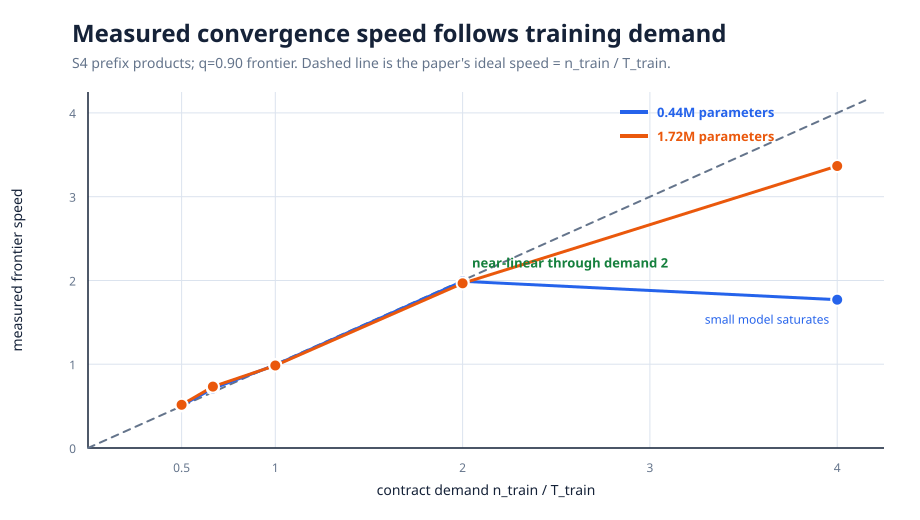
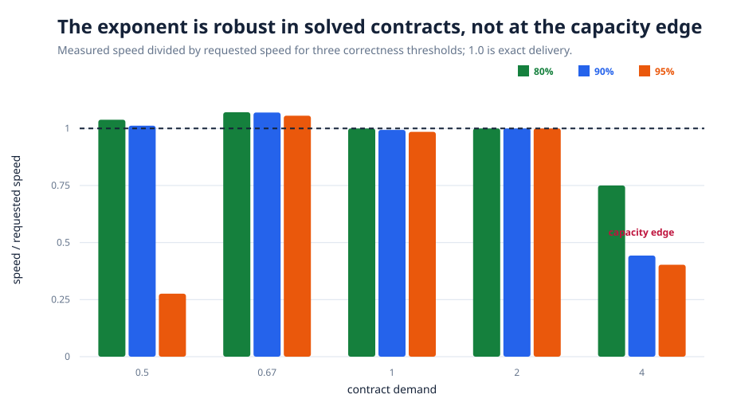
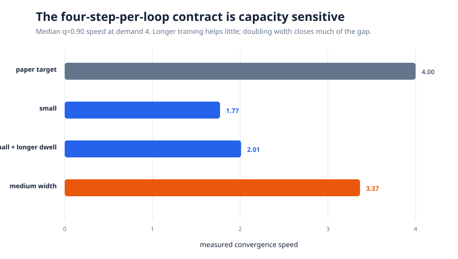
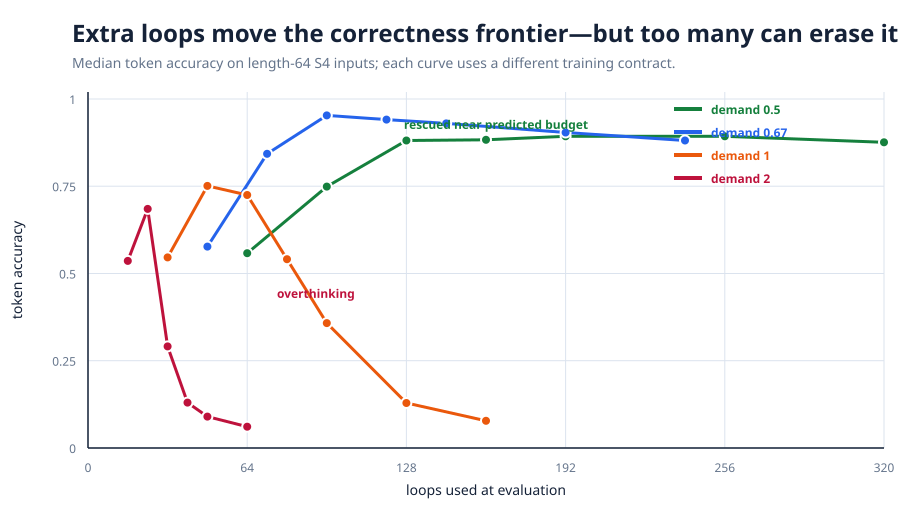
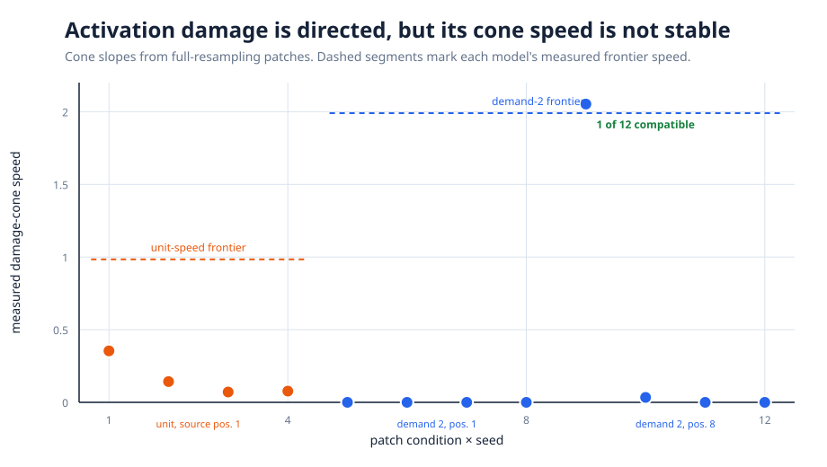

# When Does Recurrence Become an Algorithm? A Fresh S4 Reproduction

A looped transformer reuses one small block of neural-network weights many times, much as an algorithm repeats the same instruction. The paper argues that training selects how quickly useful information advances through those repetitions: fewer loops during training should force a faster internal algorithm. This reproduction asks whether that simple budget rule predicts both ordinary accuracy and the extra computation needed on longer sequences.

**Verdict — partially reproduced.** On synthetic S4 prefix products, the compact model followed the requested convergence speed from demand 0.5 through 2 with exponent **0.968** (\(R^2=0.998\)), close to the paper’s **0.98 ± 0.04**; its unit contract measured **0.991**. A 4× demand exceeded the compact model’s capacity, while doubling width raised the full-range exponent to **0.897** (\(R^2=0.996\)). Extra loops rescued late positions in the slower contracts, but a matching activation-damage cone appeared in only **1 of 12** seed/location tests.

**Scope.** This is a fresh, downscaled S4-first test with 0.44M- and 1.72M-parameter, two-layer transformers trained to length 32. A reduced A5 extension was also attempted. Every result came from Kubernetes on **NVIDIA RTX PRO 6000 Blackwell** GPUs, four per run and **16 at peak concurrency**; the fresh compute campaign spanned **1.243 wall hours** from the first successful contract start to the final successful run.

Read the dashed diagonal as exact delivery: a demand of 2 asks correctness to advance two positions per loop. Both widths hug that line through demand 2. At demand 4 the small model reaches only 1.77, whereas the medium model reaches 3.37, exposing a capacity boundary rather than an unqualified scaling law.

## What was implemented

S4 examples are random permutations whose targets are running group products. The model has no positional encoding: it embeds the input, repeatedly applies the same pre-normalized two-layer attention/MLP block, adds a learned projection of the input at every loop, and decodes every position after every loop. AdamW used learning rate \(3\times10^{-4}\), weight decay 0.01, batch 256, gradient clipping 1, and a length curriculum 4→8→16→32.

Each training contract sets loops \(T=n/d\), where \(d\) is requested speed. Four distributed workers trained independent seeds. At evaluation, a position counted as converged once its accuracy crossed 90%; a line fit to the loopwise contiguous-correct prefix gave frontier speed. Thresholds 80%, 90%, and 95% were preregistered as a robustness check. These choices reconstruct missing author details rather than claiming bitwise equivalence.

## Claim 1: training budget selects speed

The compact architecture delivered the requested speed across a fourfold range, demand 0.5–2: measured medians were **0.509, 0.710, 0.991, and 1.990**. Eight independent unit-contract seeds clustered around 0.99. Fitting those four conditions gives exponent 0.968 and \(R^2=0.998\), quantitatively aligned with the paper.

The relationship is stable across thresholds for solved 0.67–2 contracts. The 95% threshold is unreliable at demand 0.5 because several seeds never sustain that accuracy, and all thresholds expose the compact model’s demand-4 shortfall. This is why the headline fit is limited to the solved regime rather than hiding the edge condition.

Longer curriculum dwell improved compact demand-4 speed only from 1.77 to 2.01. Increasing width from 128 to 256 raised it to 3.37; one of four seeds remained slow. Across the medium model’s complete demand 0.5–4 matrix, the exponent was 0.897. Thus, “training budget selects speed” is supported, while exact linear delivery depends on enough model capacity and successful optimization.

## Claim 2: frontier speed predicts useful extra loops

At length 64, the demand-0.5 model receives only half the computation it needs at 64 loops. Its median token accuracy rises from 0.56 at 64 loops to 0.88 around the speed-predicted 109–138 loops. Demand 0.67 similarly rises from 0.58 at 48 loops to 0.95 at 96. In the medium 0.5 model, two stable seeds reached 0.94–0.98 near their predicted halting budgets.

Rescue is not monotone. Unit and demand-2 models peak near their training-implied boundaries, then rapidly lose accuracy: at fixed length 32, demand 2 rises from 0.55 at 8 loops to 0.996 near the predicted 17, then falls to 0.47 by 32. The frontier therefore predicts a useful stopping region, not permission to loop indefinitely.

## Claim 3: activation damage shares the frontier slope

Replacing one position’s activation with a resampled example produced essentially zero upstream damage, consistent with forward information flow. Quantitative slopes were not stable: four unit-speed seeds produced shallow slopes 0.07–0.35 versus frontier speed 0.98; early demand-2 patches were overwritten; and only one mid-prefix seed produced a compatible 2.05 slope versus frontier speed 1.98. Strong self-damage appeared when patches landed near the active computation time, suggesting a narrow, timing-dependent mechanism rather than the clean cone recovered in the paper.

## Claim-by-claim assessment

| Claim | Paper | Fresh observation | Assessment | Compute |
|---|---:|---:|---|---|
| Budget-law exponent | 0.98 ± 0.04, \(R^2=.99\) | 0.968, \(R^2=.998\), demand 0.5–2 | Aligned in solved S4 regime | 4 GPUs/run, 16 peak |
| Unit contract | speed ≈1 | 0.991 across 8 seeds | Aligned | two 4-GPU runs |
| Full 0.5–4 frontier | linear | medium exponent 0.897; speed 3.37 at demand 4 | Partially aligned | five medium contracts |
| Extra-loop rescue | frontier predicts rescue | 0.56→0.88 (d=0.5); 0.58→0.95 (d=.67) | Aligned, with overthinking | length-64 evaluation |
| Damage cone | slope compatible with frontier | compatible in 1/12 tests | Inconclusive under this intervention | three 4-seed patch grids |
| A5 extension | analogous algorithmic regime | q90 speed 0.61; OOD near chance | Not shown in reduced horizon | one 4-GPU run |

## Interpretation and limits

The strongest result is causal in the training contract: changing only loops per input selects a correspondingly different rate of progress, and the learned rate anticipates how much extra computation helps. The failures are equally informative. Width changes the highest sustainable rate; seeds can undertrain or overthink; and activation corruption is sensitive to amplitude, position, and timing.

This is not a full paper replication. It uses S4 as primary evidence, shorter curricula, reconstructed thresholds, and smaller models; rescue batches were independently sampled at each loop count. A definitive follow-up needs the authors’ exact architecture and curriculum, paired rescue batches, more seeds at demand 4, and a preregistered patch sweep that measures probability changes as well as argmax damage.

The exact training entrypoint is [`train_repro.py`](../../train_repro.py), configuration is [`config.json`](../../config.json), and figure data are encoded in [`scripts/make_figures.py`](../../scripts/make_figures.py). The [interactive notebook](../../notebooks/convergence_budget_reproduction.py) contains the compact evidence table and recomputes the fits without requiring retraining.
