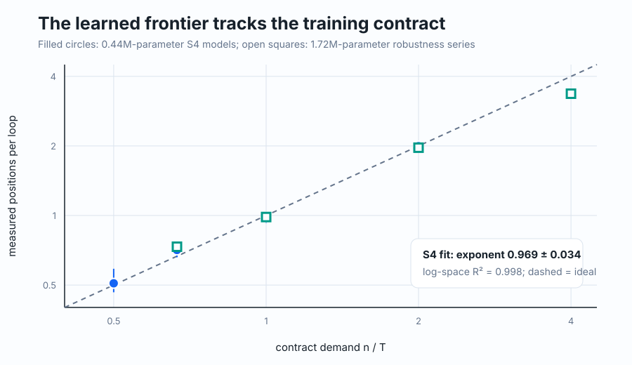
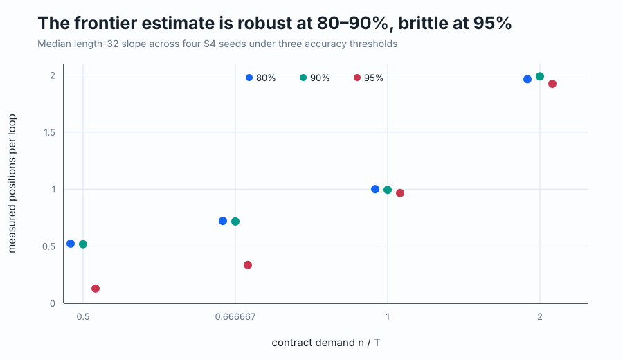
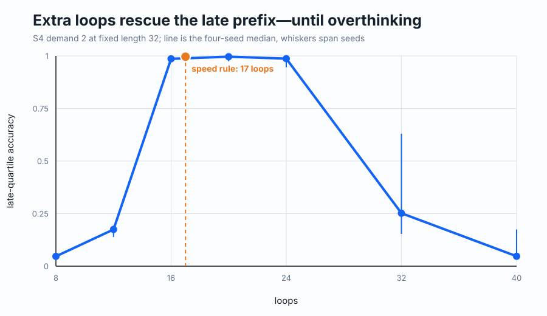
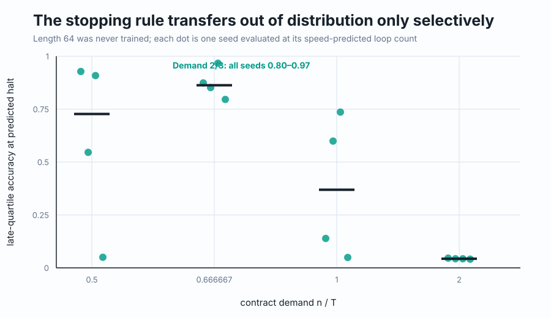
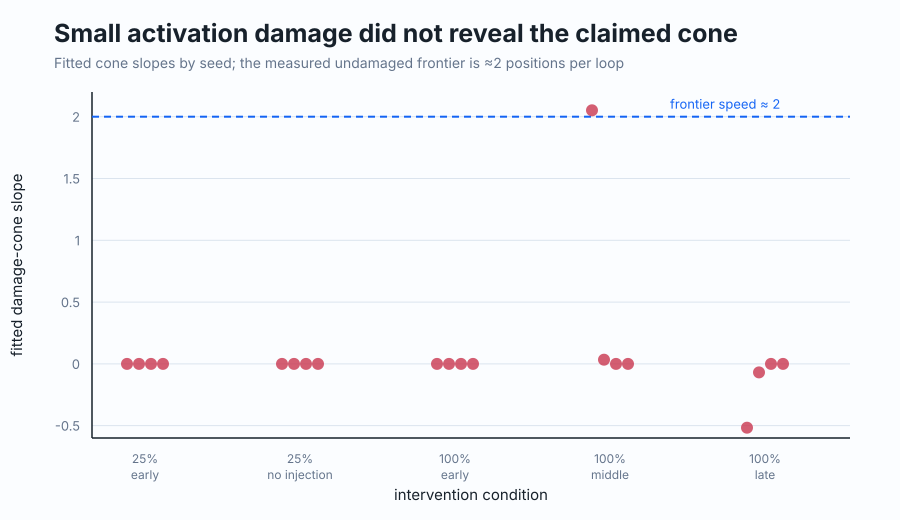

# Reproducing Convergence Selection in Looped Transformers

Some sequence problems can be solved only by moving information forward step by step. The paper argues that a model which repeats the same block learns a predictable rate for that movement, set by how many repeats it received during training. This reproduction tested that rate, whether extra repeats rescue longer computations, and whether a local disturbance travels at the same speed.

## Verdict

**Partially reproduced.** The central S4 budget law aligned across four competent contracts, including unit speed, and a controlled loop-rescue test was strong. Transfer to unseen length 64 was selective, however, and the requested small activation-damage cone was not observed.

**How to read this figure.** Contract demand is training length divided by training loops: demand 2 asks each loop to settle two positions. The dashed diagonal is the paper’s prediction. Our smaller S4 models (filled circles) gave exponent **0.969 ± 0.034** with log-space **R² = 0.998**; the paper reports **0.98 ± 0.04** and R² = 0.99. Open squares show a width-256 capacity check, not points in the headline fit.

## What was reconstructed

The named task was S4 prefix products: each token is a permutation, and every output is the product of the prefix ending there. A two-layer, width-128, four-head transformer reused exactly the same weights at every loop and had no positional encoding. Four independent seeds per contract trained through lengths 4, 8, 16, and 32 with AdamW, batch 256, learning rate 3e-4, and promotion at 98% training accuracy.

The paper does not provide author code or a complete hyperparameter table. We reconstructed group encoding, initialization, input reinjection, and convergence thresholds. The resulting standard PyTorch model has 0.44M parameters, below the paper’s stated roughly 1.6M for its small configuration; a 1.72M width-256 series checks that substitution. S4 is the primary evidence. A bounded A5 extension trained only one of four seeds through the curriculum and is inconclusive.

| Claim | Paper result | Observed result | Assessment |
|---|---|---|---|
| Budget sets frontier speed | Speeds 0.51, 1.00, 2.00, 4.00; exponent 0.98 | At demands 0.5, 0.667, 1, 2: **0.509, 0.710, 0.984, 1.994**; exponent 0.969 | **Aligned in tested competent range** |
| Frontier speed predicts useful loops | Extra loops rescue late unseen positions | Strong at fixed length 32; at unseen length 64, all seeds transferred only for demand 0.667 | **Partially aligned** |
| Damage propagates at frontier speed | Compatible causal-cone slope | Every 25% patch had slope 0; one of four full middle-prefix replacements had slope 2.052 | **Inconclusive under stronger patch; small-patch effect absent** |

The main S4 claim used four 4-GPU Kubernetes runs (4–19 minutes each). The fixed rescue used one 4-GPU run lasting 4m15s. Causal checks used 4-GPU runs lasting 4–8 minutes each.

## The budget law is sharp but threshold-sensitive

Independent repeats at demands 1 and 2 yielded medians 0.992 and 1.990. The medium-width series measured 0.733, 0.984, 1.966, and 3.367 at demands 0.667, 1, 2, and 4; at demand 4, three seeds clustered at 3.35–3.44 while one was unstable. The small model did not reach the competence gate at demand 4, so its apparent slope was excluded.

The preregistered 80% and 90% frontiers agree. Requiring 95% per-position accuracy makes the two slow contracts brittle, so the exponent should be read as a 90%-frontier result rather than a threshold-free constant.

## More loops rescue computation, then erase it

For demand 2 at length 32, the nominal eight-loop under-budget evaluation had median late-prefix accuracy **0.047**. Accuracy reached **0.986** at 16 loops. The in-distribution speed predicted 17 loops and achieved **0.996** late-prefix accuracy and 0.936 exact match; continuing to 32–40 loops sharply degraded performance. A control without input reinjection repeated the 17-loop result across all seeds.

Length 64 was never trained. The demand-0.667 contract was the clean positive case: predicted halting gave late accuracy **0.80–0.97** across seeds, compared with about 0.04 after half the nominal budget. Demand 0.5 and 1 were seed-variable, and demand 2 remained near chance despite the correct in-distribution speed. The speed law therefore identifies a useful loop budget only when length generalization has already survived.

## The small causal cone did not appear

A 25% donor-state patch at an early position produced no downstream extent in four standard seeds and four no-input-reinjection controls, even with a more permissive 1% damage threshold. Full replacement at a middle position produced a compatible slope in one seed but self-healed in three; early and late placements were zero or irregular. Upstream damage was consistently zero, but that directional fact alone is not the claimed cone.

## Assessment and provenance

Fresh post-cutoff Kubernetes evidence supports the paper’s central mechanistic budget law over demand 0.5–2 and supports loop rescue in one unseen-length contract. It does not establish general OOD rescue or the small-damage propagation slope. All formal runs used Kubernetes on NVIDIA RTX PRO 6000 Blackwell GPUs, peaking at 16 GPUs concurrently; actual campaign wall time was **1.376 hours** (2026-07-26 12:24:34–13:47:07 UTC). A full reproduction still needs the authors’ exact architecture and measurement code, competent small models at demand 4, and a reliable A5/S5 curriculum.

Key branches: [slow S4 endpoint](https://github.com/alphaXiv/when-does-recurrence-become-an-algorithm-converg/tree/orx/fresh-s4-t-2n-demand-0-5), [unit-speed S4](https://github.com/alphaXiv/when-does-recurrence-become-an-algorithm-converg/tree/orx/fresh-s4-t-n-kubernetes-fix), [demand-2 S4](https://github.com/alphaXiv/when-does-recurrence-become-an-algorithm-converg/tree/orx/fresh-s4-t-n-2-demand-2), [fixed loop rescue](https://github.com/alphaXiv/when-does-recurrence-become-an-algorithm-converg/tree/orx/demand-2-fixed-length-n-32-rescue), and [causal placement test](https://github.com/alphaXiv/when-does-recurrence-become-an-algorithm-converg/tree/orx/demand-2-mid-prefix-damage-cone).

Exact Molab URL: <https://molab.marimo.io/github/alphaXiv/when-does-recurrence-become-an-algorithm-converg/blob/main/notebooks/convergence_selection.py>
